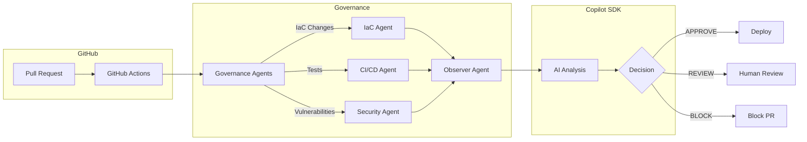

# Enterprise CI/CD Governance powered by GitHub Copilot SDK

> **AI-driven governance for software delivery** - Intelligent PR analysis, security scanning, and deployment decisions using the GitHub Copilot SDK.

[](https://github.com/AndressaSiqueira/enterprise-cicd-agents/actions/workflows/ci.yml)
[](https://github.com/AndressaSiqueira/enterprise-cicd-agents/actions/workflows/cd.yml)

---

## 🎯 Problem Statement

Enterprise software delivery faces significant governance challenges:

1. **Manual PR Reviews are Inconsistent**: Human reviewers miss security issues, infrastructure risks, and policy violations due to fatigue and time pressure
2. **Deployment Decisions are Subjective**: "Is this safe to deploy to production?" often depends on who you ask
3. **Security Scanning is Reactive**: Vulnerabilities are discovered after code merges, not during review
4. **Compliance is Audited, Not Enforced**: Policies exist but are only checked during compliance audits

### The Cost of These Problems
- 🔓 Security breaches from inadequate code review
- 🚨 Production incidents from risky deployments
- ⏱️ Delayed releases waiting for manual approvals
- 📝 Compliance failures requiring expensive remediation

---

## 💡 Solution

**Enterprise CI/CD Governance** uses the **GitHub Copilot SDK** to provide AI-powered governance decisions that are:

- **Consistent**: Same analysis criteria applied to every PR
- **Evidence-Based**: Decisions cite specific code changes, test results, and security findings
- **Policy-Driven**: Enterprise rules encoded as code, enforced automatically
- **Transparent**: Clear explanations for every APPROVE, REVIEW, or BLOCK decision

### How It Works



---

## 🏗️ Architecture

```mermaid
graph TB
    subgraph "API Layer"
        API[Express Server<br/>:3000]
        MCP[MCP Server<br/>stdio]
    end
    
    subgraph "Copilot SDK Integration"
        SDK[@github/copilot-sdk]
        Tools[Governance Tools]
        Prompts[System Prompts]
    end
    
    subgraph "GitHub Integration"
        Octokit[@octokit/rest]
        Actions[GitHub Actions]
    end
    
    subgraph "Observability"
        OTEL[OpenTelemetry]
        Traces[Distributed Traces]
    end
    
    subgraph "Azure Deployment"
        ACA[Container Apps]
        ACR[Container Registry]
    end
    
    API --> SDK
    MCP --> SDK
    SDK --> Tools
    SDK --> Prompts
    API --> Octokit
    Actions --> API
    API --> OTEL --> Traces
    API --> ACA
    ACA --> ACR
```

### Key Components

| Component | Purpose | Technology |
|-----------|---------|------------|
| **Governance API** | REST endpoints for PR analysis, security scanning, deployment decisions | Express + TypeScript |
| **MCP Server** | Exposes tools for AI assistants | @modelcontextprotocol/sdk |
| **Copilot Integration** | AI-powered decision making | @github/copilot-sdk |
| **GitHub Integration** | PR data, checks, security alerts | @octokit/rest |
| **Observability** | Distributed tracing | OpenTelemetry |

---

## 📋 Prerequisites

- **Node.js** 20.x or higher
- **npm** 10.x or higher
- **GitHub Account** with access to Copilot
- **GitHub Personal Access Token** with `repo` scope
- **Docker** (for containerized deployment)
- **Azure CLI** (for Azure deployment)

---

## 🚀 Setup

### 1. Clone and Install

```bash
git clone https://github.com/AndressaSiqueira/enterprise-cicd-agents.git
cd enterprise-cicd-agents
npm install
```

### 2. Configure Environment

```bash
# Create .env file
cat > .env << EOF
GITHUB_TOKEN=ghp_your_token_here
PORT=3000
NODE_ENV=development
EOF
```

### 3. Build and Test

```bash
npm run build
npm test
npm run lint
```

### 4. Run Locally

```bash
# Start API server
npm run dev

# In another terminal, test the endpoints
curl http://localhost:3000/health

# Analyze a PR
curl -X POST http://localhost:3000/api/governance/analyze-pr \
  -H "Content-Type: application/json" \
  -d '{"owner":"your-org","repo":"your-repo","prNumber":123}'
```

### 5. Run MCP Server

```bash
npm run mcp:start
```

---

## 📦 Deployment

### Deploy to Azure Container Apps

```bash
# Login to Azure
az login

# Create resource group
az group create --name rg-cicd-governance --location eastus

# Deploy with Azure Developer CLI
azd init
azd up
```

### Docker Deployment

```bash
# Build image
docker build -t enterprise-cicd-governance .

# Run container
docker run -p 3000:3000 \
  -e GITHUB_TOKEN=$GITHUB_TOKEN \
  enterprise-cicd-governance
```

### GitHub Actions Integration

The repository includes CI/CD workflows that automatically:

1. **CI Pipeline** (`ci.yml`): Runs on every PR
   - Build and test
   - Run governance agents
   - Post analysis as PR comment
   - Block merge if DENY decision

2. **CD Pipeline** (`cd.yml`): Runs on merge to main
   - Deploy to staging (automatic)
   - Run governance check
   - Deploy to production (requires approval)

---

## 📖 API Reference

### `POST /api/governance/chat`

Interactive governance chat with AI.

```json
{
  "message": "Should I merge this PR that changes the authentication system?",
  "context": {
    "owner": "my-org",
    "repo": "my-app",
    "prNumber": 42
  }
}
```

### `POST /api/governance/analyze-pr`

Comprehensive PR analysis.

```json
{
  "owner": "my-org",
  "repo": "my-app",
  "prNumber": 42
}
```

### `POST /api/governance/security-scan`

Security vulnerability scanning.

```json
{
  "owner": "my-org",
  "repo": "my-app"
}
```

### `POST /api/governance/deployment-decision`

Deployment approval decision.

```json
{
  "owner": "my-org",
  "repo": "my-app",
  "environment": "production",
  "sha": "abc123"
}
```

---

## 🔧 MCP Tools

The MCP server exposes these tools for AI assistants:

| Tool | Description |
|------|-------------|
| `analyze_pull_request` | Comprehensive PR analysis with risk assessment |
| `check_security_vulnerabilities` | npm audit + GitHub security alerts |
| `evaluate_deployment_readiness` | Pre-deployment checklist |
| `get_infrastructure_changes` | Detect IaC changes (Terraform, Bicep) |
| `generate_governance_report` | Markdown report for PR comments |
| `check_policy_compliance` | Validate against enterprise policies |

---

## 🏛️ Enterprise Use Cases

### 1. Automated PR Governance

```
Developer opens PR → CI triggers → Governance API analyzes →
AI evaluates risks → Decision posted as comment → 
APPROVE (auto-merge) / REVIEW (request changes) / BLOCK (fail CI)
```

### 2. Pre-Deployment Security Gate

```
Code merged → CD triggers → Security scan runs →
AI evaluates vulnerabilities → High severity? → BLOCK deployment
```

### 3. Production Change Management

```
Production IaC change detected → Require 2 approvals →
AI generates deployment checklist → Human confirms →
Deploy with rollback plan
```

---

## ⚖️ Responsible AI (RAI) Considerations

### Transparency
- All AI decisions include reasoning and evidence
- Governance reports are human-readable
- Decision history is fully auditable via OpenTelemetry traces

### Human Oversight
- AI recommends, humans decide for critical actions
- Production deployments always require human approval
- "REVIEW" decisions escalate to human reviewers

### Fairness
- Same governance rules applied to all PRs regardless of author
- No author-specific biases in decision making
- Policies are explicit and auditable

### Security
- GITHUB_TOKEN stored securely (Key Vault in production)
- No credentials logged or exposed in responses
- Rate limiting recommended for production deployment

### Limitations
- AI analysis is advisory, not infallible
- Complex architectural decisions require human judgment
- Novel security threats may not be detected

### Data Handling
- Only repository metadata and code diff is analyzed
- No personal data collection beyond GitHub usernames
- Data processing complies with GitHub's data policies

For detailed RAI documentation, see [docs/rai.md](docs/rai.md).

---

## 🧪 Testing Locally

### Run the server and test:

```bash
# Build and test
npm run ci:local

# Start the server
npm run dev

# Test health endpoint
curl http://localhost:3000/health
```

### Test with a real PR:

```bash
# Start the server
npm run dev

# Analyze a PR
curl -X POST http://localhost:3000/api/governance/analyze-pr \
  -H "Content-Type: application/json" \
  -d '{"owner":"microsoft","repo":"vscode","prNumber":12345}'
```

---

## 📁 Project Structure

```
enterprise-cicd-agents/
├── src/
│   ├── server/           # Express API with Copilot SDK
│   │   ├── index.ts      # Main server
│   │   ├── tools.ts      # Copilot SDK tools
│   │   └── prompts.ts    # System prompts
│   ├── mcp/              # MCP server
│   │   └── server.ts     # Tool implementations
│   ├── agents/           # Rule-based agents
│   │   ├── iac-agent/    # Infrastructure detection
│   │   ├── cicd-agent/   # Test analysis
│   │   ├── security-agent/  # npm audit
│   │   └── observer-agent/  # Policy evaluation
│   └── shared/           # Utilities
├── app/                  # Sample application
├── infra/                # Sample IaC (staging/prod)
├── policies/             # Policy-as-code YAML
├── docs/                 # Documentation
├── .github/workflows/    # CI/CD workflows
├── AGENTS.md             # Agent instructions
├── mcp.json              # MCP configuration
└── package.json
```

---

## 🤝 Contributing

1. Fork the repository
2. Create a feature branch
3. Submit a PR (and watch the governance in action!)

---

## 📄 License

MIT License - See [LICENSE](LICENSE) for details.

---

## 🔗 Links

- [GitHub Copilot SDK Documentation](https://github.com/github/copilot-sdk)
- [Model Context Protocol](https://modelcontextprotocol.io/)
- [Azure Container Apps](https://learn.microsoft.com/azure/container-apps/)
- [OpenTelemetry](https://opentelemetry.io/)
