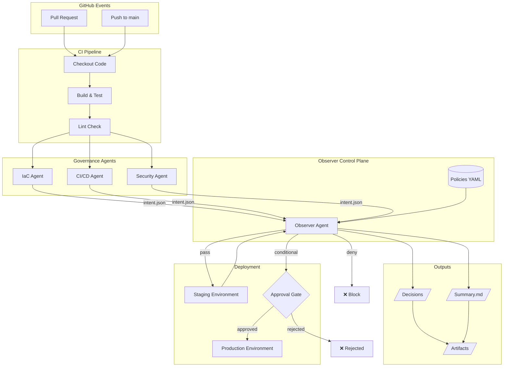
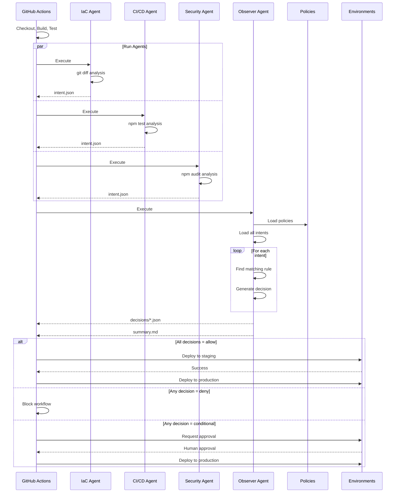
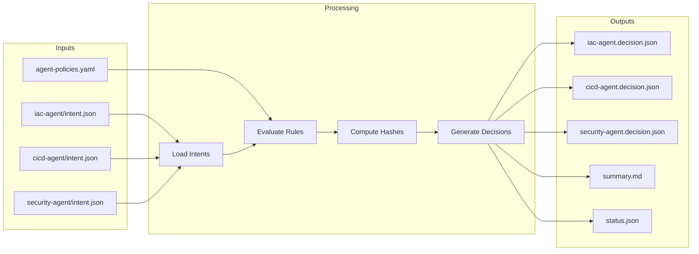
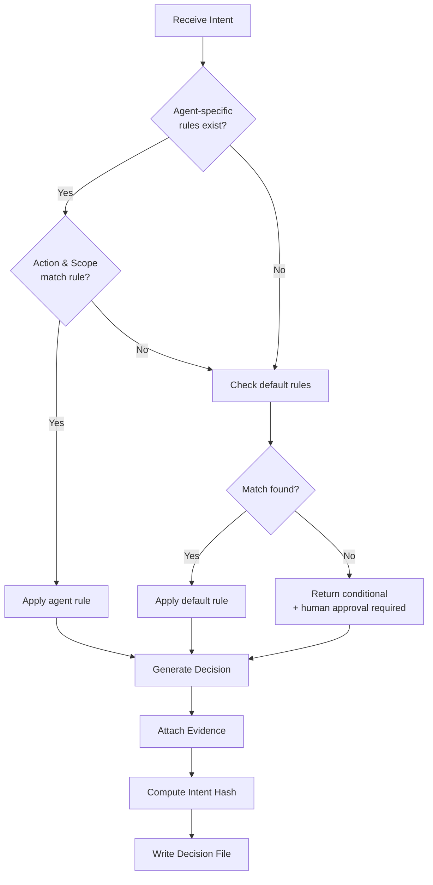
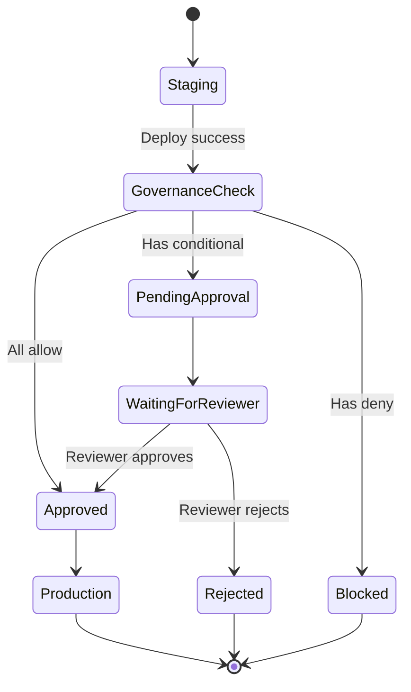

# Architecture Overview

This document describes the architecture of the agentic CI/CD governance system.

## System Architecture

## Data Flow

## Component Details

### Agent Layer

Each agent is responsible for a specific domain:

| Agent | Domain | Inputs | Outputs |
|-------|--------|--------|---------|
| IaC Agent | Infrastructure changes | Git diff | `plan_infra`, `apply_infra` |
| CI/CD Agent | Test health | Jest results | `verify_pipeline`, `rerun_pipeline` |
| Security Agent | Vulnerabilities | npm audit | `block_pr`, `approve_security` |

### Observer Agent (Control Plane)

The Observer Agent acts as the governance control plane:

### Policy Evaluation Logic

### Environment Protection Flow

## Security Considerations

1. **Least Privilege**: Workflows use minimal permissions
2. **Audit Trail**: All decisions include evidence and hashes
3. **Policy Separation**: Policies stored separately from code
4. **Environment Protection**: Production requires explicit approval
5. **Artifact Retention**: Governance artifacts retained for compliance

## Extensibility Points

1. **New Agents**: Add to `/src/agents/` following existing patterns
2. **New Policies**: Update `/policies/agent-policies.yaml`
3. **Custom Exporters**: Replace console OTEL exporter with OTLP
4. **Notifications**: Add to notification job in CD workflow
