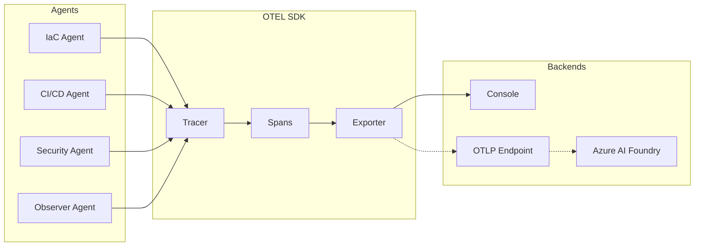

# Responsible AI & Observability

This document explains the OpenTelemetry instrumentation in the agentic CI/CD system and its role in responsible AI practices.

## Overview

The agentic governance system includes built-in OpenTelemetry (OTEL) instrumentation to provide:

1. **Observability**: Trace agent execution and decision-making
2. **Auditability**: Record evidence for compliance and debugging
3. **Performance Monitoring**: Track agent execution times
4. **Foundry-Ready Integration**: Compatible with Azure AI Foundry and other AI platforms

## Why OTEL for Agentic Systems?

### The Auditability Challenge

Agentic systems make autonomous decisions that affect production deployments. Traditional logging captures what happened, but OTEL provides:

- **Distributed Tracing**: Follow a decision through multiple agents
- **Structured Attributes**: Machine-readable metadata for analysis
- **Correlation**: Link decisions to specific GitHub runs, commits, actors
- **Timing**: Precise measurement of each step

### Complementary to Other Instrumentation

This OTEL implementation is **complementary** to:

| Instrumentation | Purpose | This System Adds |
|-----------------|---------|------------------|
| Application APM | Monitor production apps | Agent decision tracing |
| GitHub Actions metrics | Workflow performance | Per-agent attribution |
| Security scanning | Vulnerability detection | Decision context |
| Audit logs | Who did what | Why and how decisions were made |

## Implementation

### Telemetry Architecture



### Span Attributes

Each agent span includes:

```typescript
{
  'agent.name': 'iac-agent' | 'cicd-agent' | 'security-agent' | 'observer-agent',
  'agent.action': 'plan_infra' | 'verify_pipeline' | ...,
  'agent.scope': 'test' | 'staging' | 'prod',
  'github.run_id': '12345678',
  'github.sha': 'abc123...',
  'github.actor': 'username',
  'github.event_name': 'pull_request' | 'push',
  'github.repository': 'org/repo',
  'duration_ms': 1234
}
```

### Events Within Spans

Spans contain events marking significant points:

- `files_retrieved`: Git diff completed
- `analysis_complete`: Agent analysis finished
- `tests_started` / `tests_completed`: Test execution
- `audit_started` / `audit_completed`: Security scan
- `policies_loaded`: Observer loaded policy file
- `intents_loaded`: Observer loaded all agent intents

## Usage

### Default: Console Exporter

By default, telemetry is exported to console (stderr):

```bash
npm run agents:run
# Spans are printed to console in readable format
```

### Production: OTLP Exporter

To send to an OTLP-compatible backend:

```typescript
// Modify src/shared/telemetry.ts
import { OTLPTraceExporter } from '@opentelemetry/exporter-trace-otlp-http';

const sdk = new NodeSDK({
  serviceName: 'enterprise-cicd-agents',
  traceExporter: new OTLPTraceExporter({
    url: process.env.OTEL_EXPORTER_OTLP_ENDPOINT,
    headers: {
      'api-key': process.env.OTEL_API_KEY,
    },
  }),
});
```

Environment variables:
```bash
OTEL_EXPORTER_OTLP_ENDPOINT=https://your-collector:4318/v1/traces
OTEL_API_KEY=your-api-key
```

### Azure AI Foundry Integration

For integration with Azure AI Foundry's agent monitoring:

1. Deploy an Azure Monitor workspace
2. Configure OTLP export to Azure Monitor
3. Link to AI Foundry project

```typescript
// Example: Azure Monitor exporter
import { AzureMonitorTraceExporter } from '@azure/monitor-opentelemetry-exporter';

const exporter = new AzureMonitorTraceExporter({
  connectionString: process.env.APPLICATIONINSIGHTS_CONNECTION_STRING,
});
```

## Responsible AI Considerations

### Transparency

- **Decision Evidence**: Every decision includes `evidence` array documenting inputs
- **Policy Traceability**: Decisions reference specific policy rules applied
- **Hash Integrity**: Intent hashes provide tamper-evidence

### Accountability

- **Actor Attribution**: GitHub actor is recorded in every span
- **Timestamp Precision**: ISO timestamps for forensic analysis  
- **Artifact Retention**: Governance artifacts retained per compliance needs

### Reliability

- **Deterministic Decisions**: Same input → same output
- **Explicit Deny Wins**: Conservative default behavior
- **Human Override**: Conditional decisions require human approval

### Safety

- **Production Protection**: Default deny for production infrastructure changes
- **Security Gate**: High/critical vulnerabilities block by default
- **Environment Protection**: GitHub Environment approval for production

## Querying Traces

### Example: Find all denied decisions

```kusto
// Azure Data Explorer / Log Analytics
traces
| where customDimensions['agent.name'] != ''
| where customDimensions['decision'] == 'deny'
| project timestamp, 
          agent=customDimensions['agent.name'],
          action=customDimensions['agent.action'],
          sha=customDimensions['github.sha'],
          actor=customDimensions['github.actor']
| order by timestamp desc
```

### Example: Agent execution latency

```kusto
traces
| where name contains 'agent'
| summarize avg(toint(customDimensions['duration_ms'])) by tostring(customDimensions['agent.name'])
```

## Best Practices

1. **Always Initialize**: Call `initTelemetry()` at agent start
2. **Use Span Wrapper**: Use `withAgentSpan()` for automatic error handling
3. **Add Context**: Set relevant attributes early in the span
4. **Record Events**: Add events at significant points
5. **Graceful Shutdown**: Call `shutdownTelemetry()` before exit

## Future Enhancements

1. **Metrics**: Add counter/histogram metrics for decisions
2. **Baggage**: Propagate context across workflow jobs
3. **Custom Samplers**: Sample based on decision type
4. **Auto-instrumentation**: Instrument npm commands automatically
